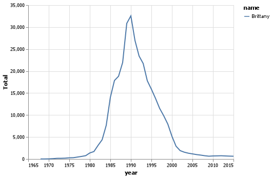
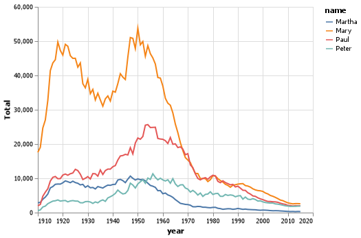
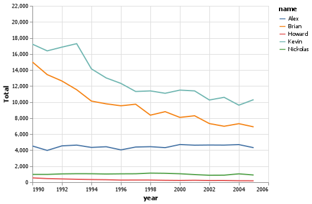

# Project Intro
__Sigmund Serranilla__

## Elevator pitch
Choosing names is quite the interesting topic, parents would rather choose names from a pool of existing names rather than invent new ones. However during the rise of Christianity, Christian names were often used to name their children (Ex: Peter, Mary, John, etc.). As time goes on even into the 21st century those Christian names have continued to gain popularity. But as time goes on the invention of new names will always occur because of popular movies, actors, video games, etc.

# TECHNICAL DETAILS
### GRAND QUESTIONS 
1.) How does your name at your birth year compare to its use historically?

- Well, my name is pretty unique and I was not able to find my name listed. But I decided to use my brother's name "Spencer" to see how his name was used historically. When using my brother's name there is a huge spike around 1984 in which the name became more popular.

2.) If you talked to someone named Brittany on the phone, what is your guess of their age? What ages would you not guess?

- I would guess that their age is between 26 - 36 because that is where the total amount of that name is used.

- I would not guess that the person would be older than 40 because the usage of that name did not start gaining popularity until around 1983 - 1984. I would also not guess them to be any younger than 21.



3.) Mary, Martha, Peter, and Paul are all Christian names. From 1920 - 2000, compare the name usage of each of the four names.

- Mary is the most widely used name during the time period of 1900 - 1970.
- As the 21st century approached the usage of these Christian names began to lose popularity.



4.)Think of a unique name from a famous movie. Plot that name and see how increases line up with the movie release.

- So I decided to look more into the Avengers (the first one) movie. I was experimenting with many of the names like "Tony", "Chris", "Loki", and even "Hulk" but I couldn't really get a good analysis because those names were pretty generic. However when I tried the actor who played "Black Widow", Scarlett Johansson, I found that there was a spike in that name. I looked further into when she first started acting near around 2007 and there was gaining popularity with the name. Ultimately with her appearences in the Marvel movies, her name became very popular.


- I did another experiment but with the renown popular group the Backstreet Boys. I listed all their names (using their real names) "Alex", "Brian", "Kevin", "Nickolas" and "Howard". It seemed that when the Backstreet Boys first came out (1992-1993) There was a slight increase in popularity for the name "Kevin", I can only assume that he was the most popular of them all.



## APPENDIX A (PYTHON SCRIPT)


```python

```