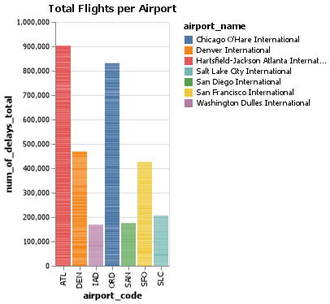
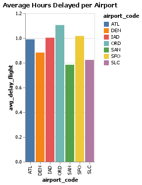
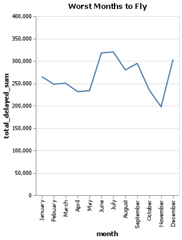
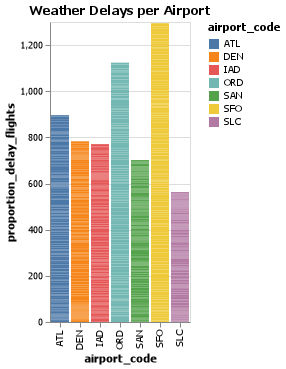

# Project 2: Planes
__Sigmund Serranilla__

## Elevator pitch
"Delayed flights are not something most people look forward to. In the best case scenario you may only wait a few extra minutes for the plane to be cleaned. However, those few minutes can stretch into hours if a mechanical issue is discovered or a storm develops. Arriving hours late may result in you missing a connecting flight, job interview, or your best friend’s wedding." 

So in this project we will be using data from various airports and examine delays based on weather, how long these delays are, which months are the worst to fly and ultimately finding out which airport is the worst.

# TECHNICAL DETAILS
### GRAND QUESTION 1
 Which airport has the worst delays? How did you choose to define “worst”? As part of your answer include a table that lists the total number of flights, total number of delayed flights, proportion of delayed flights, and average delay time in hours, for each airport.


 
- This chart here shows the total amount of flights delayed for each airport. As you can see Atlanta (ATL) and Chicago (ORD) have a high amount of delayed flights. It may seem that Atlanta is the worst aiport due to them having the highest total of delays. However this doesn't get the clear picture on which is the worst aiport.



- However I'm going to prove that San Francisco's Airport is the worst aiport because although Atlanta may have around 500,000 more total flights delayed (See "Total Flights" chart) compared to San Francisco's total flights delayed. Atlanta has more air traffic, but is able to keep the average just about the same as San Francisco that gets less air traffic. In conclusion with less total flights delayed, this shows that San Francisco's airport has bad efficiency in dealing with delays, resulting in it being the worst airport.


|     | airport_code   | airport_name                             |   year | month     |   num_of_flights_total |   num_of_delays_total |   avg_delay_flight_hours |
|----:|:---------------|:-----------------------------------------|-------:|:----------|-----------------------:|----------------------:|-------------------------:|
| 919 | ATL            | Hartsfield-Jackson Atlanta International |   2010 | September |                  33850 |                  5411 |                     0.98 |
| 920 | DEN            | Denver International                     |   2012 | September |                  18601 |                  4747 |                     0.86 |
| 921 | SAN            | San Diego International                  |   2014 | September |                   6430 |                  1326 |                     0.72 |
| 922 | SFO            | San Francisco International              |   2014 | September |                  14372 |                  4560 |                     0.96 |
| 923 | SAN            | San Diego International                  |   2010 | September |                   6981 |                  1304 |                     0.82 |


### GRAND QUESTION 2
What is the worst month to fly if you want to avoid delays? Include one chart to help support your answer, with the x-axis ordered by month. You also need to explain and justify how you chose to handle the missing Month data.


- I'm going to prove that the worst months to fly would be during the months of June, July and December. The reason for choosing those months is because they have over 300,000 total delays across all aiports. I can assume that those are prime times for people to be traveling for holidays (Christmas for December) and vacation (summer break during the months June-July).

- I noticed there were many paterns in the data. The way that I handled the missing data was sort the values by month. I then proceeded to use the "replace" function and the "fillna(method = 'ffill')" to replace all the "n/a" values to be filled with that particular month.

```python
flights = flights.sort_values("month")

flights.month = flights.month.replace("n/a", np.nan).fillna(method = "ffill")
```

### GRAND QUESTION 3
According to the BTS website the Weather category only accounts for severe weather delays. Other “mild” weather delays are included as part of the NAS category and the Late-Arriving Aircraft category. Calculate the total number of flights delayed by weather (either severe or mild) using these two rules:

- 30% of all delayed flights in the Late-Arriving category are due to weather.
- From April to August, 40% of delayed flights in the NAS category are due to weather. The rest of the months, the proportion rises to 65%.

### GRAND QUESTION 4
Create a barplot showing the proportion of all flights that are delayed by weather at each airport. What do you learn from this graph (Careful to handle the missing Late Aircraft data correctly)?


- From this graph we can see that San Francisco has the most weather delays compared to other airports. Interesting also to know that although Atlanta has 500,000 total more delayed flights compared to SFO, only around 900 are due to weather delays.

### GRAND QUESTION 5
Fix all of the varied NA types in the data and save the file back out in the same format that was provided. Provide one example from the file with the new NA values shown.


q5 = df.to_json(orient='records')...
{'airport_code': 'ATL',
 'airport_name': ' Hartsfield-Jackson Atlanta International',
 'month': 'January',
 'year': 2005.0,
 'num_of_flights_total': 35048,
 'num_of_delays_carrier': '1500+',
 'num_of_delays_late_aircraft': -999,
 'num_of_delays_nas': 4598,
 'num_of_delays_security': 10,
 'num_of_delays_weather': 448,
 'num_of_delays_total': 8355,
 'minutes_delayed_carrier': 116423.0,
 'minutes_delayed_late_aircraft': 104415,
 'minutes_delayed_nas': 207467.0,
 'minutes_delayed_security': 297,
 'minutes_delayed_weather': 36931,
 'minutes_delayed_total': 465533,
 'state': 'Atlanta, GA'}

```json
        "airport_code": "ATL",
        "airport_name": " Hartsfield-Jackson Atlanta International",
        "month": "January",
        "year": 2005.0,
        "num_of_flights_total": 35048,
        "num_of_delays_carrier": "1500+",
        "num_of_delays_late_aircraft": -999,
        "num_of_delays_nas": 4598,
        "num_of_delays_security": 10,
        "num_of_delays_weather": 448,
        "num_of_delays_total": 8355,
        "minutes_delayed_carrier": 116423.0,
        "minutes_delayed_late_aircraft": 104415,
        "minutes_delayed_nas": 207467.0,
        "minutes_delayed_security": 297,
        "minutes_delayed_weather": 36931,
        "minutes_delayed_total": 465533,
        "state": "Atlanta, GA"
```


## APPENDIX A (PYTHON SCRIPT)
```python
#%%
# Import libraries
import pandas as pd 
import altair as alt 
import numpy as np 

#%%
# internal packages
import urllib3 
import json

#%%
### USEFUL FUNCTIONS
# list(df_delay_weather_1['airport_code'].unique())

#%%
# Load the Data
url = "https://github.com/byuidatascience/data4missing/raw/master/data-raw/flights_missing/flights_missing.json"

http = urllib3.PoolManager()
response = http.request('GET', url)
flights_json = json.loads(response.data.decode('utf-8'))
df = pd.json_normalize(flights_json)

df = pd.read_json(url)

#%%
# NOTES:
# If I wanted to fix NaN values for months, I can use interpolate(), but I would have to change all the months into numbers
#   Ex: January == 1, march == 3

# df.isnull().sum()
#   This gets the sum of all the missing values.
#%%
df['state'] = df['airport_name'].str.split(':').str.get(0)
df['airport_name'] = df['airport_name'].str.split(':').str.get(1)

# Creating a new column called "state" and "airport name"
#   - The first split with "0" represents taking everything on the left side of the ":"
#   - The second split with "1" represents taking everything on the right side of the ":"


# Something I see in the data is it goes 2008, 2009, 2010, 2011, NaN, 2013, etc.
#   or January, Febuary, March, NaN, May, NaN, July, etc.
#   It is very obvious that there is a pattern with Nan is 2012 or NaN is April, so how do I fix that?

#%%
flights = df.sort_values("airport_code")
# Puts everything in alphabetical order
flights.airport_name = flights.airport_name.replace("n/a", np.nan).fillna(method = "ffill")

#%%
flights = flights.sort_values("year")

flights.year = flights.year.replace("n/a", np.nan).fillna(method = "ffill")

# Everything on the left side of the equal will d
# Right side will reference airport_name in flights

#%%
flights = flights.sort_values("month")

flights.month = flights.month.replace("n/a", np.nan).fillna(method = "ffill")


# %%
# Grand Question 1

# Add avgerage hours per delayed flight
flights = flights.assign(
    avg_delay_flight_hours = lambda x: round(x['minutes_delayed_total'] / x['num_of_delays_total'] / 60, 2)
).reset_index()

#%%
#flights = flights.groupby(["airport_code"]).minutes_delayed_total.sum()
#%%
#flights_1 = flights.groupby(["airport_code"]).avg_delay_flight.mean()

flights_1 = flights.groupby("airport_code").agg(
    avg_delay_flight = ("avg_delay_flight_hours", "mean")
).reset_index()

#%%
# I wanted to have the chart at the bottom look similar to the chart above. For some reason,
#   I'm not sure how to input airport_name into the groupby...or that specific groupby mean total
#   for all the airports into my flights data frame

chart_line_airport = (alt.Chart(flights_1)
    .encode(
        #x = alt.X("year", scale=alt.Scale(domain=[2004, 2016]), axis=alt.Axis(format='.0f')),
        x = "airport_code",
        y = alt.Y("avg_delay_flight"),
        color = "airport_code" #"airport_name"
        )
    .mark_bar()
    .properties(title = "Average Hours Delayed per Airport")
)

chart_line_airport_1 = (alt.Chart(flights)
    .encode(
        #x = alt.X("year", scale=alt.Scale(domain=[2004, 2016]), axis=alt.Axis(format='.0f')),
        x = "airport_code",
        y = alt.Y("num_of_delays_total"),
        color = "airport_name"
        )
    .mark_bar()
    .properties(title = "Total Flights per Airport")
)

chart_line_airport.save("airport_1.png")
chart_line_airport_1.save("airport_2.png")
#%%
# Proportion of delayed flights
# How do I find the proportion of delayed flights?
flights = flights.assign(
    proportion_delay_flights = lambda x: round(x['num_of_delays_total'] / x['num_of_flights_total'] * 100, 2)
)


#%%
df_delay = flights[[
    "airport_code", "airport_name", "year", "month", "num_of_flights_total",
    "num_of_delays_total", "proportion_delay_flights","avg_delay_flight_hours"
    ]]

#%%
# Print out the table
print((df_delay
    .tail(5)
    .filter(["airport_code", "airport_name", "year", "month", "num_of_flights_total",
    "num_of_delays_total", "avg_delay_flight_hours"])
    .to_markdown()))
#%%
# Grand Question 2
# I want to get the total of 'num_of_delays_total' for a single month. I then want it to be just 'December' and the 'total'.
# USE a Groupby

sorted_months = ["January", "Febuary", "March", "April", "May", "June", "July", "August", "September", "October", "November", "December"]

worst_month = flights.groupby("month").agg(
    total_delayed_sum = ("num_of_delays_total", "sum")
).reset_index()

#worst_month = df.groupby("month").num_of_delays_total.sum()

#worst_month = worst_month.drop(12)

#%%
# Chart
chart_line_airport_3 = (alt.Chart(worst_month)
    .encode(
        x = alt.X("month", sort = sorted_months),
        y = alt.Y("total_delayed_sum", scale=alt.Scale(domain=[0, 400000])),
        #color = "airport_code"
        )
    .mark_line()
    .properties(title="Worst Months to Fly")
)
chart_line_airport_3.save("airport_3.png")

#%%
# Grand Question 3
# "assign" is the same as replace, but creates a whole new data frame with that additional column that I created.
weather = flights.assign(
    # "N/a", " ", "-999" are all null. Normalizing it, and replacing it with 0
    # "x" at "lambda x:"" is short-hand for our dataframe that we are using
    late_aircraft_na = lambda x: x.num_of_delays_late_aircraft.replace(-999, 0), 
    severe = lambda x: x.num_of_delays_weather,
    mild_late = lambda x: x.late_aircraft_na * 0.3,
    mild_nas = lambda x: np.where(
        x.month.isin(["April", "May","June","July","August"]),
        x.num_of_delays_nas * 0.4,
        x.num_of_delays_nas * 0.65),
    weather_total = lambda x: x.severe + x.mild_late + x.mild_nas
).filter(['airport_code', 'airport_name','month','severe','mild_late',
'mild_nas','num_of_flights_total','weather_total'])

# If you want to filter out rows USE "Query"
# If you want to filter out columns USE "Filter"

#%%
# Grand Question 4

# cannot groupby with numerical values, only with categorical values
flights.groupby("airport_code").minutes_delayed_carrier.mean()
#%%
weather = weather.assign(
    proportion_delay_flights = lambda x: round(x['weather_total'] / x['num_of_flights_total'] * 100, 2)
)

#%%
weather_1 = weather.groupby("airport_code").agg(
    proportion_delay_flight = ("proportion_delay_flights", "sum") #would I use mean?
).reset_index()

#%%
# Chart
chart_line_airport_4 = (alt.Chart(weather)
    .encode(
        #x = alt.X("year", scale=alt.Scale(domain=[2004, 2016]), axis=alt.Axis(format='.0f')),
        x = "airport_code",
        y = alt.Y("proportion_delay_flights"),
        color = "airport_code" #I want to use "airport_name"
        )
    .mark_bar()
    .properties(title = "Weather Delays per Airport")
)
chart_line_airport_4.save("airport_4.png")

#%%
flights.minutes_delayed_carrier = flights.minutes_delayed_carrier.replace("n/a", np.nan).fillna(method = "ffill")

# %%
# Grand Question 5

# Print out the table
print((df
    .tail(5)
    .filter(["airport_code", "airport_name", "year", "month", "num_of_flights_total",
    "num_of_delays_total", "avg_delay_flight_hours"])
    .to_markdown()))


# %%
#---Notes 5/20/2021---#
# can i only grab ORD and find the Nan ones?
df.head(25).to_json("practice.json", orient='records')

#os.cwd()

# %%
q5 = flights.to_json(orient='records')
q5part2 = json.loads(q5)
q5part2[0]

# %%
q5 = df.to_json(orient='records')
q5part2 = json.loads(q5)
q5part2[0]
# %%

```