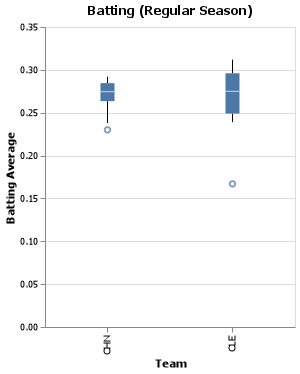
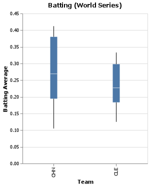

# Project 2: Planes
__Sigmund Serranilla__

## Elevator pitch
When you hear the word “relationship” what is the first thing that comes to mind? Probably not baseball. But a relationship is simply a way to describe how two or more objects are connected. There are many relationships in baseball such as those between teams and managers, players and salaries, even stadiums and concession prices. 

In this I will be showing you relationships within baseball and how things like Salary, hits, At-Bats and much more can give powerful insights.

# TECHNICAL DETAILS
### GRAND QUESTION 1
Write an SQL query to create a new dataframe about baseball players who attended BYU-Idaho. The new table should contain five columns: playerID, schoolID, salary, and the yearID/teamID associated with each salary. Order the table by salary (highest to lowest) and print out the table in your report.

|    |   yearid | teamid   | playerid   | schoolid   |   salary |
|---:|---------:|:---------|:-----------|:-----------|---------:|
|  0 |     2014 | CHA      | lindsma01  | idbyuid    |  4000000 |
|  1 |     2012 | BAL      | lindsma01  | idbyuid    |  3600000 |
|  2 |     2011 | COL      | lindsma01  | idbyuid    |  2800000 |
|  3 |     2013 | CHA      | lindsma01  | idbyuid    |  2300000 |
|  4 |     2010 | HOU      | lindsma01  | idbyuid    |  1625000 |
|  5 |     2001 | SLN      | stephga01  | idbyuid    |  1025000 |
|  6 |     2002 | SLN      | stephga01  | idbyuid    |   900000 |
|  7 |     2003 | SLN      | stephga01  | idbyuid    |   800000 |
|  8 |     2000 | SLN      | stephga01  | idbyuid    |   550000 |
|  9 |     2009 | FLO      | lindsma01  | idbyuid    |   410000 |
| 10 |     2008 | FLO      | lindsma01  | idbyuid    |   395000 |
| 11 |     2007 | FLO      | lindsma01  | idbyuid    |   380000 |
| 12 |     1999 | SLN      | stephga01  | idbyuid    |   215000 |
| 13 |     1998 | PHI      | stephga01  | idbyuid    |   185000 |
| 14 |     1997 | PHI      | stephga01  | idbyuid    |   150000 |


### GRAND QUESTION 2
This three-part question requires you to calculate batting average (number of hits divided by the number of at-bats)
- Write an SQL query that provides playerID, yearID, and batting average for players with at least one at bat. Sort the table from highest batting average to lowest, and show the top 5 results in your report.


|    |   yearid | playerid   |   hits |   at_bats |   at_bats_average |
|---:|---------:|:-----------|-------:|----------:|------------------:|
|  0 |     1889 | mccafsp01  |      1 |         1 |                 1 |
|  1 |     1874 | snowch01   |      1 |         1 |                 1 |
|  2 |     1893 | oconnfr01  |      2 |         2 |                 1 |
|  3 |     1893 | gumbebi01  |      1 |         1 |                 1 |
|  4 |     1884 | baldwki01  |      1 |         1 |                 1 |


- Write an SQL query that provides playerID, yearID, and batting average for players with at least one at bat. Sort the table from highest batting average to lowest, and show the top 5 results in your report.


|    |   yearid | playerid   |   hits |   at_bats |   at_bats_average |
|---:|---------:|:-----------|-------:|----------:|------------------:|
|  0 |     1974 | nymanny01  |      9 |        14 |             0.643 |
|  1 |     2013 | carsoma01  |      7 |        11 |             0.636 |
|  2 |     1910 | altizda01  |      6 |        10 |             0.6   |
|  3 |     1975 | johnsde01  |      6 |        10 |             0.6   |
|  4 |     1948 | silvech01  |      8 |        14 |             0.571 |


- Now calculate the batting average for players over their entire careers (all years combined). Only include players with more than 100 at bats, and print the top 5 results.

|    |   years_played | playerid   |   hits |   at_bats |   at_bats_average |
|---:|---------------:|:-----------|-------:|----------:|------------------:|
|  0 |             25 | rosepe01   |   4256 |     14053 |             0.273 |
|  1 |             23 | aaronha01  |   3771 |     12364 |             0.28  |
|  2 |             23 | yastrca01  |   3419 |     11988 |             0.266 |
|  3 |             21 | ripkeca01  |   3184 |     11551 |             0.128 |
|  4 |             24 | cobbty01   |   4189 |     11436 |             0.238 |

### GRAND QUESTION 3
Pick any two baseball teams and compare them using a metric of your choice (average salary, home runs, number of wins, etc.). Write an SQL query to get the data you need. Use Python if additional data wrangling is needed, then make a graph in Altair to visualize the comparison. Provide the visualization and its description.

- For this question I will be comparing two baseball teams that were the best in the MLB. The Chicago Cubs (National League) and the Cleveland Indians (American League). In the graphs below I will convince you that the Chicago Cubs were the better team during the regular season and post season.

- In the Batting (Regular Season) boxplot I took the batting average of players who had 250 or more "At Bats". As you can see from this Chicago had a *tighter spread* for batting averages. Even the player with the lowest batting average on the Cubs (0.230) during the regular season is much higher than Cleveland's player with the lowest batting average (0.167). The graph clearly shows that many of the Cubs' players were very consistent throughout the season.
- In the Batting (World Series) boxplot I took the batting average of players who had 5 or more "At Bats". Although the batting averages for the Cubs are more spread out, the 75 percentile batting averages are much higher for the Cubs (0.380) compared to Cleveland (0.298). 

 


## APPENDIX A (PYTHON SCRIPT)
```python
#%%
import datadotworld as dw
import pandas as pd
import altair as alt 
import numpy as np 
#%%
results_s = dw.query('byuidss/cse-250-baseball-database', 
    'SELECT * FROM Salaries')

results_cp = dw.query('byuidss/cse-250-baseball-database', 
    'SELECT * FROM CollegePlaying')

salaries = results_s.dataframe
college_playing = results_cp.dataframe
#%%
#----------GRAND QUESTION 1----------#

### USE CollegePlaying and Salaries
q = '''
SELECT 
    s.yearid,
    s.teamid, 
    s.playerid, 
    cp.schoolid, 
    s.salary
FROM Salaries as s
    JOIN CollegePlaying as cp
    ON s.playerid = cp.playerid 
WHERE
    cp.schoolid = 'idbyuid'
GROUP BY
    s.salary
ORDER BY 
    s.salary DESC
'''

# Is byui labeled as idbyuid? 
# How do I get rid of the duplicates?

results_cp_s = dw.query('byuidss/cse-250-baseball-database', q).dataframe
results_cp_s

#%%
# Print for markdown
print(results_cp_s.to_markdown())
# %%
#----------GRAND QUESTION 2----------#
### PART 1
w = '''
SELECT
    yearid,
    playerid,
    h as hits,
    ab as at_bats,
    ROUND(h / ab, 3) as at_bats_average
FROM Batting 
WHERE
    h >= 1
ORDER BY
    at_bats_average DESC
LIMIT 5
'''
results_at_bats_avg = dw.query('byuidss/cse-250-baseball-database', w).dataframe
results_at_bats_avg

#%%
# Print for markdown
print(results_at_bats_avg.to_markdown())
# %%
### PART 2
e = '''
SELECT
    yearid,
    playerid,
    h as hits,
    ab as at_bats,
    ROUND(h / ab, 3) as at_bats_average
FROM Batting 
WHERE
    ab >= 10
ORDER BY
    at_bats_average DESC
LIMIT 5
'''
results_at_bats_avg_1 = dw.query('byuidss/cse-250-baseball-database', e).dataframe
results_at_bats_avg_1

#%%
# Print for markdown
print(results_at_bats_avg_1.to_markdown())
# %%
### PART 3
r = '''
SELECT
    COUNT(yearid) as years_played,
    playerid,
    SUM(h) as hits,
    SUM(ab) as at_bats,
    ROUND(h / ab, 3) as at_bats_average
FROM Batting 
WHERE
    ab >= 100 
GROUP BY 
    playerid
ORDER BY
    at_bats_average DESC
LIMIT 5
'''
results_at_bats_avg_2 = dw.query('byuidss/cse-250-baseball-database', r).dataframe
results_at_bats_avg_2

#%%
# Print for markdown
print(results_at_bats_avg_2.to_markdown())

# %%
### PART 3.1
# I want to see people who played in the 2000s and above.
#   
r = '''
SELECT
    COUNT(yearid) as years_played,
    playerid,
    SUM(h) as hits,
    SUM(ab) as at_bats,
    ROUND(h / ab, 3) as at_bats_average
FROM Batting 
WHERE
    h >= 100 AND
    yearid >= 2000 AND
    yearid >= 5
GROUP BY playerid
ORDER BY
    at_bats_average DESC
LIMIT 5
'''
results_at_bats_avg_2 = dw.query('byuidss/cse-250-baseball-database', r).dataframe
results_at_bats_avg_2
# %%
#----------GRAND QUESTION 3----------#
# PITCHING POST CUBS vs CLE
t = '''
SELECT
    yearid,
    round as world_series,
    teamid,
    playerid,
    G as games_played,
    SO as strikeouts,
    BAOpp as opp_batting_avg,
    HBP as batters_hit,
    R as runs_allowed
FROM PitchingPost
WHERE 
    round = "WS" AND
    yearid = 2016
ORDER BY
    teamid ASC
'''
results_pitching_post = dw.query('byuidss/cse-250-baseball-database', t).dataframe
results_pitching_post

#%%
# Batting regular season
# 1.) Sort them through NL and AL
# I want to understand how I can get the team total batting average.
u = '''
SELECT
    yearID,
    teamID,
    lgID as division,
    playerID,
    R as runs,
    H as hits,
    AB as at_bats,
    ROUND(h / ab, 3) as batting_average,
    RBI,
    SO as strikeouts
FROM Batting
WHERE 
    (AB >= 250 AND
    yearid = 2016) AND
    (teamID = "CHN" OR teamID = "CLE")
ORDER BY
    teamid ASC,
    batting_average DESC
'''

# FOR chart use mark_circle (for the other teams) + mark_line (for the Chicago Cubs that will be a horizontal line.)
results_batting_reg = dw.query('byuidss/cse-250-baseball-database', u).dataframe
results_batting_reg

#%%
round(results_batting_reg.query("teamID == 'CHN'")["batting_average"].mean(), 3)

round(results_batting_reg.query("teamID == 'CLE'")["batting_average"].mean(), 3)

#%%
# Filtering down the data to make a box plot
results_chn = (results_batting_reg.query("teamID == 'CHN'"))
results_cle = (results_batting_reg.query("teamID == 'CLE'"))
#%%
# Chart CLE batting average
chart_batting_cle_chn = (alt.Chart(results_batting_reg
)
    .encode(
        x = alt.X("teamID", title = "Team"),
        y = alt.Y("batting_average", title = "Batting Average"),
        )
    .mark_boxplot()
    .properties(title = "Batting (Regular Season)",
    width = 250
    )
)
chart_batting_cle_chn.save("chartbattingclechn.png")
chart_batting_cle_chn

# %%
# Batting POST CUBS vs CLE
y = '''
SELECT
    yearid,
    round as world_series,
    teamid,
    playerid,
    h as hits,
    ab as at_bats,
    ROUND(h / ab, 3) as batting_average,
    RBI,
    SO as strikeouts
FROM BattingPost
WHERE 
    (round = "WS" AND
    yearid = 2016) AND
    ab >= 5
ORDER BY
    teamid ASC,
    batting_average DESC
'''
results_batting_post = dw.query('byuidss/cse-250-baseball-database', y).dataframe
results_batting_post

#%%
# Chart CLE batting average
chart_batting_cle_chn_post = (alt.Chart(results_batting_post)
    .encode(
        x = alt.X("teamid", title = "Team"),
        y = alt.Y("batting_average", title = "Batting Average"),
        )
    .mark_boxplot()
    .properties(title = "Batting (World Series)",
    width = 250
    )
)
chart_batting_cle_chn_post.save("chartbattingclechnpost.png")
chart_batting_cle_chn_post
```